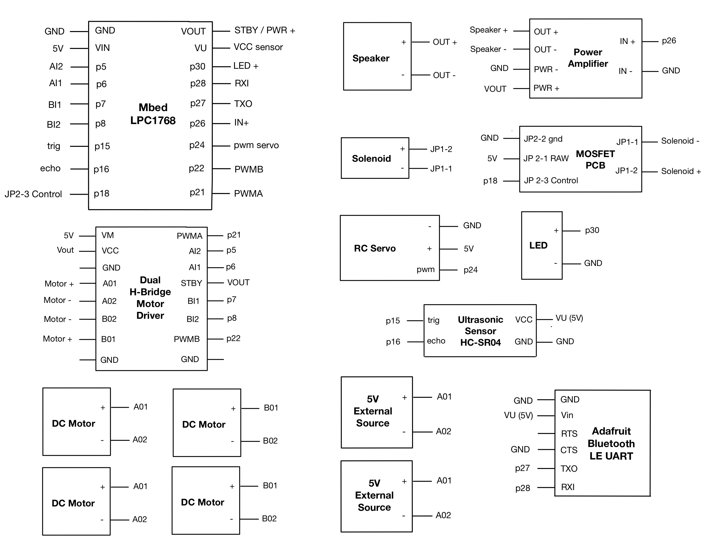

# TechTreat Trailblazer

Georgia Institute of Technology ECE 4180 Final Project

Team Members: Chanel Gautama, Gayoung Nam, Jeremy Chen

## Description

TechTreat Trailblazer is a bluetooth-controlled pet feeder robot that dispenses food, drive around and play with your pets.
The main functionalities are:
  - Move forward, backward, and make left/right turns
  - A ultrasonic sensor prevents the robot from crashing to objects
  - Dispenses pet food
  - Honk and display a mini light show

## List of Components
  - Mbed
  - 4 DC Motors
  - 4 Wheels
  - Dual H-Bridge
  - Ultrasonic Sensor (HC-SR04)
  - Speaker
  - Power Amplifier
  - LED
  - RC Servo
  - Solenoid 
  - MOSFET Driver Motor
  - Adafruit Bluetooth Module
  - 2 5V External Power Supplies
  - Metal Plate
  - Breadboard
  - Jumper Wires
  - Plastic water bottles
  - Cardboard

## Mbed Components Pinouts
 Dual H-Bridge and Motors
 
 |  H-Bridge  |  Mbed  |  Right Motor  |  Left Motor  |  Battery Pack  |
 |------------|--------|---------------|--------------|----------------|
 |     VM     |        |               |              |        +       |
 |    VCC     |  VOUT  |               |              |                |
 |    GND     |   GND  |               |              |        -       |
 |    STBY    |  VOUT  |               |              |                |
 |    PWMA    |   p21  |               |              |                |
 |    AIN1    |   p6   |               |              |                |
 |    AIN2    |   p5   |               |              |                |
 |    AO1     |        |       +       |              |                |
 |    AO2     |        |       -       |              |                |
 |    BO1     |        |               |       +      |                |
 |    BO2     |        |               |       -      |                |
 |    PWMB    |   p22  |               |              |                |
 |    BIN1    |   p7   |               |              |                |
 |    BIN2    |   p8   |               |              |                |
 
 
 Ultrasonic Sensor
 
 |  Mbed    |   HC-SR04   |
 |----------|-------------|
 |  Vu(5V)  |     Vcc     |
 |   Gnd    |     Gnd     |
 |    p15   |     trig    |
 |    p16   |     echo    |
 
 
 Power Amplifier and Speaker
 
 |  Mbed   |  Class D Audio Amp  | Speaker | External Battery |
 |---------|---------------------|---------|------------------|
 |   GND   |     PWR, IN-        |         |                  |
 |         |       PWR+          |         |        5V        |
 |   p26   |        IN+          |         |                  |
 |         |       OUT+          |    +    |                  |
 |         |       OUT-          |    -    |                  |

 LED
 
 |          Mbed         |   LED   |
 |-----------------------|---------|
 |          p30          |    +    |
 |          GND          |    -    |
 

 RC Servo
 
 |  Mbed   |       servo      | External Battery |
 |---------|------------------|------------------|
 |   GND   |         -        |       Gnd        |
 |         |         +        |        5V        |
 |   p24   | PWM Signal Input |                  |

 Solenoid 
 
 |  Mbed   |    MOSFET PCB      |     Solenoid    | External Battery |
 |---------|--------------------|-----------------|------------------|
 |   GND   |     JP2-2 gnd      |                 |       gnd        |
 |         |     JP2-1 RAW      |                 |       5V         |
 |   p18   |     JP2-3 Control  |                 |                  |
 |         |     JP1-1          |     Device(-)   |                  |
 |         |     JP1-2          |     Device(+)   |                  |

 Adafruit Bluetooth
 
 |          Mbed         |   Adafruit BLE   |
 |-----------------------|------------------|
 |          gnd          |        gnd       |
 |          Vu           |        Vin       |
 |          nc           |        RTS       |
 |          gnd          |        CTS       |
 |     p27 (Serial RX)   |        TXO       |
 |     p28 (Serial TX)   |        RXI       |

## Wiring Diagram

## Mbed Code
The entire code for this robot can be found at ().
